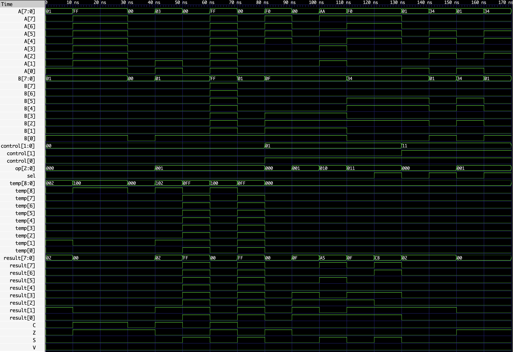
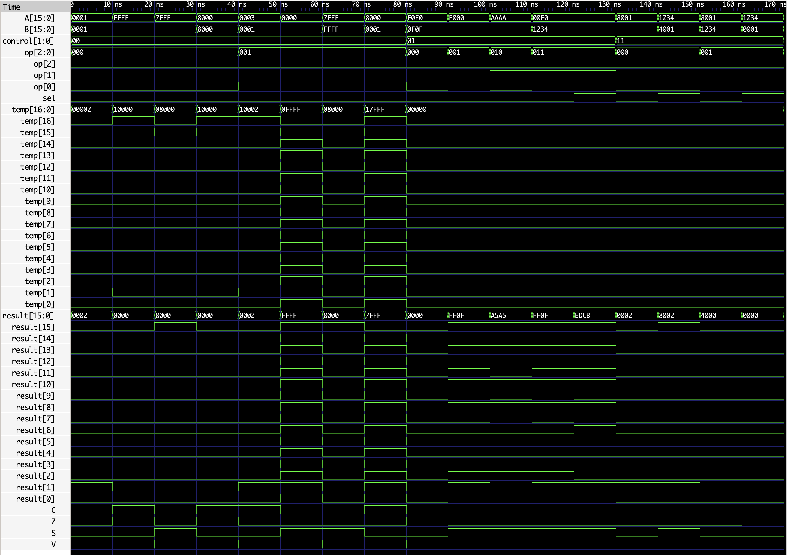

# Parameterized SystemVerilog ALU

A combinational arithmetic logic unit (ALU) whose data-path width is set with a parameter. The default configuration is 16 bits, and the same design can be instantiated at other widths, including 8 bits.

## Features

- Configurable `WIDTH` parameter (default: `16`)
- Arithmetic: addition and subtraction
- Bitwise logic: AND, OR, XOR, and NOT
- One-bit logical shifts: left and right
- Status flags for carry/no-borrow, zero, sign, and signed overflow
- Purely combinational implementation using `always_comb`

## Interface

| Signal | Direction | Description |
| --- | --- | --- |
| `A`, `B` | Input | `WIDTH`-bit operands |
| `control` | Input | Selects the operation group |
| `op` | Input | Selects an operation within the group |
| `sel` | Input | Selects the source operand for NOT and shift operations (`0` = `A`, `1` = `B`) |
| `result` | Output | `WIDTH`-bit operation result |
| `C` | Output | Carry-out for addition; **no-borrow** indicator for subtraction |
| `Z` | Output | Set when `result` is zero |
| `S` | Output | Sign flag, equal to `result[WIDTH-1]` |
| `V` | Output | Signed-overflow flag for addition and subtraction |

## Control and Operation Encoding

| `control` | `op` | Operation | Result |
| --- | --- | --- | --- |
| `00` | `000` | ADD | `A + B` |
| `00` | `001` | SUB | `A - B` |
| `01` | `000` | AND | `A & B` |
| `01` | `001` | OR | `A | B` |
| `01` | `010` | XOR | `A ^ B` |
| `01` | `011` | NOT | `sel ? ~B : ~A` |
| `11` | `000` | Shift left | `sel ? (B << 1) : (A << 1)` |
| `11` | `001` | Shift right | `sel ? (B >> 1) : (A >> 1)` |

All other `control`/`op` combinations produce a zero result. The implementation has no operation group for `control = 10`.

## Flags

The ALU first clears all flags, then sets the applicable outputs for the selected operation.

- **`C` — carry / no-borrow:** During addition, `C` is the carry-out bit. During subtraction, the design performs two's-complement subtraction and sets `C = 1` when no borrow is required; `C = 0` indicates a borrow. Logic and shift operations leave `C` cleared.
- **`Z` — zero:** Set when `result` is all zeros.
- **`S` — sign:** Always reflects the most-significant result bit, `result[WIDTH-1]`.
- **`V` — signed overflow:** Set only for arithmetic operations. Addition overflows when operands have the same sign and the result has the opposite sign. Subtraction overflows when operands have different signs and the result's sign differs from `A`.

## How It Works

`control` chooses the arithmetic, logic, or shift block; `op` then selects the exact function. Arithmetic uses a `WIDTH+1`-bit temporary value so the extra high bit can provide carry/no-borrow information. The lower `WIDTH` bits become `result`. After the operation is evaluated, the ALU derives the zero and sign flags from `result`.

For unary NOT and shifts, `sel` selects the operand: low selects `A`, high selects `B`. Shifts are logical one-bit shifts as expressed in the design (`<< 1` and `>> 1`).

## Parameterization

The module is declared with a default 16-bit width:

```systemverilog
alu_WIDTH_bit #(
    .WIDTH(16)
) alu_16bit (...);
```

Instantiate the same module for an 8-bit ALU by overriding `WIDTH`:

```systemverilog
alu_WIDTH_bit #(
    .WIDTH(8)
) alu_8bit (...);
```

Ensure that the connected `A`, `B`, and `result` signals use the same selected width.

## Simulating

The following commands compile the design and testbench with Icarus Verilog, then run the simulation:

```bash
iverilog -g2012 -o alu_sim design.sv testbench.sv
vvp alu_sim
```

If the testbench writes a VCD file (for example, `waveform.vcd`), open it in GTKWave:

```bash
gtkwave waveform.vcd
```

Use the actual VCD filename emitted by `testbench.sv` if it differs.

## Waveforms

### 8-bit configuration



### 16-bit configuration



## Repository Structure

```text
.
├── design.sv        # Parameterized ALU implementation
├── testbench.sv     # Simulation testbench
├── 8-bit_wave.png   # Waveform for the 8-bit configuration
├── 16-bit_wave.png  # Waveform for the 16-bit configuration
└── README.md
```
